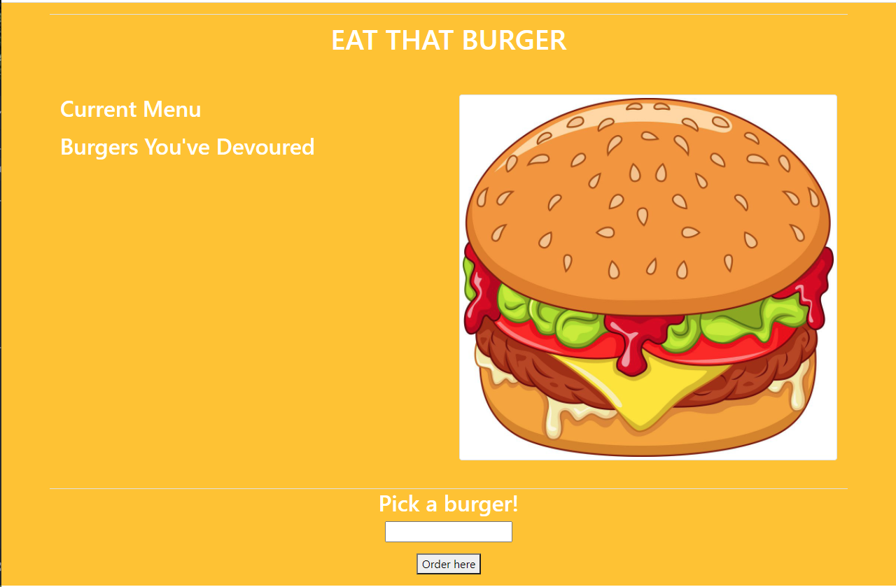

# Orm Burger

 

## Description
Are you hungry? Well that's too bad this app can't feed you, but you can definitely pretend! This app stores your burger orders in a database where you can eat it, sell it, or order another! It follow the MVC software design pattern.

## **Table of Contents**

1. [Usage](#usage)
2. [License](#license)
3. [Contributors](#contributors)
4. [Technologies](#technologies)
5. [Visuals](#visuals)
6. [Demos](#demos)
7. [Links](#links)

## **Usage**
Pretty straight forward, to use this go to the app, add your favorite burger, and pretend you ate it to sate your mental hunger.

## **License**
Copyright (c) 2021, Joseph Flygare

## **Contributors**
Joseph Flygare
* Wow amazing!

## **Technologies**
* Javascript
* Node
* Express
* Handlebars.js
* MySQL
* Heroku

## **Questions**
Contact our team at jayfly64@gmail.com for any questions 

## **Visuals**
